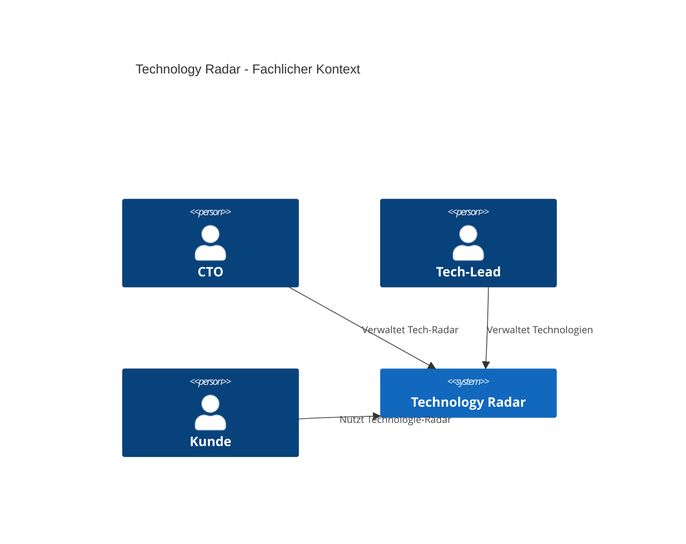
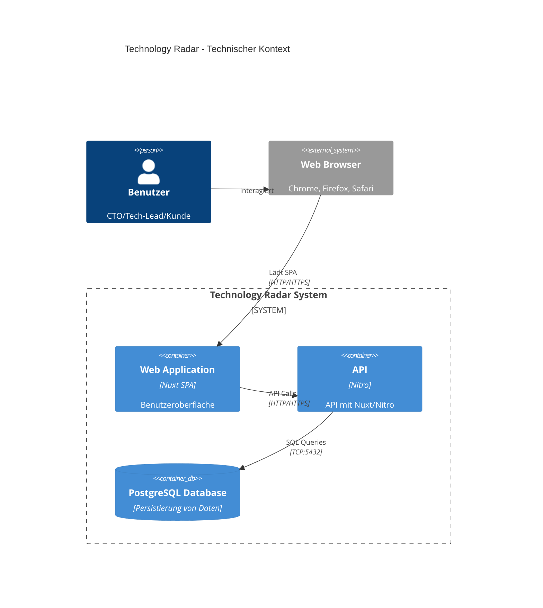
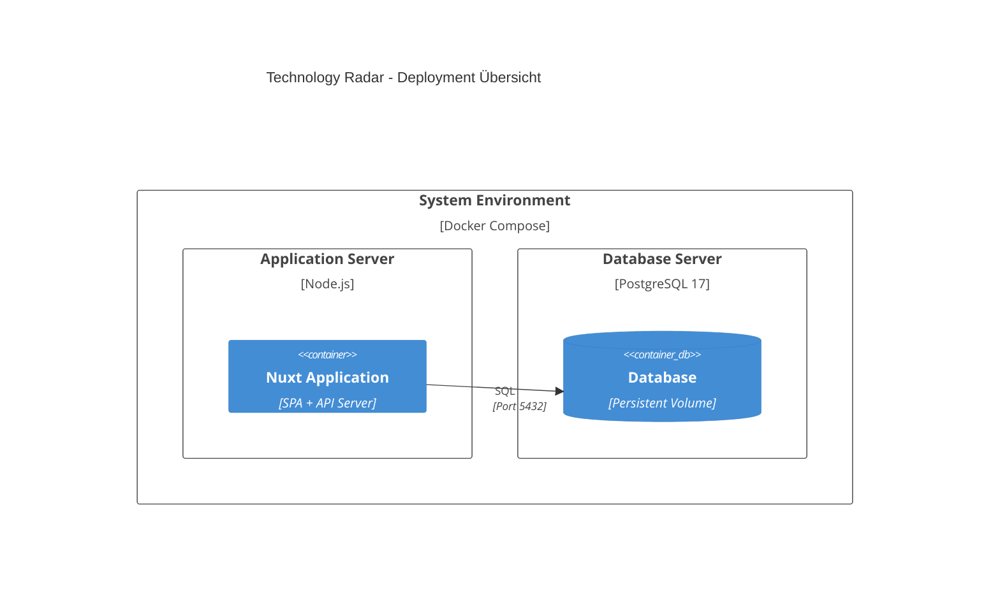

# Dokumentation Technologieradar

## Einführung und Ziele

### Aufgabenstellung

Das **Technology Radar** ist eine Webanwendung, die es Unternehmen und Organisationen ermöglicht, verschiedene Technologien zu kategorisieren, bewerten und deren Entwicklung zu verfolgen. Die Anwendung soll Teams dabei unterstützen, fundierte Entscheidungen über die Adoption neuer Technologien zu treffen.

### Kernfunktionen

- Verwaltung von Technologien in verschiedenen Kategorien (Framework, Tool, Technique, Platform)
- Bewertung von Technologien in vier Ringen (Adopt, Trial, Assess, Hold)
- Visuelle Darstellung als interaktiver Radar mit D3.js
- Multi-Workspace-Unterstützung für verschiedene Organisationseinheiten
- Benutzer- und Rechteverwaltung mit JWT-basierter Authentifizierung
- Verwaltung von Technologien durch CTO und Tech-Lead
- Verwaltung von Mitglieder durch CTO

### Qualitätsziele

| Priorität | Qualitätsziel | Szenario |
|-----------|---------------|----------|
| 1 | **Benutzerfreundlichkeit** | Intuitive Bedienung der Radar-Visualisierung, einfache Navigation zwischen Workspaces |
| 2 | **Performance** | Schnelle Ladezeiten der Radar-Darstellung auch bei >100 Technologien pro Workspace |
| 3 | **Wartbarkeit** | Saubere Trennung Frontend/Backend, modularer Aufbau, vollständige Typisierung |
| 4 | **Sicherheit** | Sichere Authentifizierung, Autorisierung auf Workspace-Ebene, Input-Validierung |

### Stakeholder

| Rolle | Erwartungshaltung |
|-------|-------------------|
| **CTO** | Administration Workspace und Verwaltung von Technologien und Mitarbeiter |
| **Tech-Lead** | Verwaltung von Technologien in einem Workspace |
| **Mitarbeiter** | Nutzen den Technologie-Radar um Infos bzgl. der eingesetzen Technologien zu erhalten |
| **Software-Entwickler** | Entwickeln und Testen die Applikation |
| **Dozenten** | Bewertung der technischen Umsetzung und Dokumentationsqualität |

## Randbedingungen


**Technische Randbedingungen:**
- **Technologien**: Zur Entwicklung des Tech-Radars muss für Frontend und Backend JavaScript bzw. TypeScript verwendet werden.
- **Radar**: Es muss nicht unbedingt ein Radar implementiert werden. Eine Tabelle würde auch reichen.
- **Responsive**: Responsive Design für Desktop und Mobile

**Organisatorische Randbedingungen:**
- **Einzelarbeit**: Das Projekt muss in einzelarbeit erarbeitet werden
- **Entwicklungszeit**: ca. 60 Stunden
- **Dokumentation**: Offen, arc42-Standard empfohlen

## Kontextabgrenzung

### Fachlicher Kontext

Dieses Diagram zeigt die fachlichen Abhängigkeiten im Technologie-Radar auf.



- **CTO**: Verwaltet Workspaces, deren Technologien und Mitglieder
- **Tech-Lead**: Verwaltet Technologien eines Workspaces
- **Kunde**: Nutzt den Technologie-Radar um Infos zu den benutzten Technologien zu erhalten

## Technischer Kontext



Nuxt 4 ist ein Fullstack Framework und erlaubt es somit, Frontend und Backend im gleichen Projekt zu verwalten. Hierbei wird zum einen Vue als Frontend genutzt und mit Nitro kann eine HTTP-API entwickelt werden.

- **Web Application**: Die Webapplikation (SPA), welche vom Browser geladen wird. Diese nutzt Nuxt 4 mit Nuxt UI & TailwindCSS
- **API**: REST-API mit Nuxt 4 / Nitro. Handhabt Business-Logik, Authentifizierung und DB-Zugriff
- **PostgreSQL Database**: Persistierung von Benutzern, Workspaces, Technologien und Login-Logs

# Lösungsstrategie

## Technologie-Entscheidungen

| Bereich | Technologie | Begründung |
|---------|------------|------------|
| **Frontend Framework** | Nuxt.js 4 + Vue.js 3 | Full-Stack-Framework mit SSR/SPA-Flexibilität, ausgereifte TypeScript-Unterstützung, grosses Ecosystem |
| **UI-Framework** | Nuxt UI + Tailwind CSS | Konsistente Design-System-Komponenten, utility-first CSS |
| **Backend** | Nuxt/Nitro Server API | Integrierte Server-API, TypeScript-Sharing zwischen Frontend/Backend, vereinfachtes Deployment |
| **Datenbank** | PostgreSQL | Robuste relationale DB, komplexe Queries, JSON-Support für Flexibilität |
| **ORM** | Drizzle ORM | Type-safe SQL-first ORM, excellente TypeScript-Integration, migrationsfähig |
| **Authentifizierung** | JWT + bcrypt | Stateless Authentication, sichere Password-Hashing |
| **Visualisierung** | D3.js | Mächtige, flexible Datenvisualisierung für interaktive Charts |
| **Testing** | Vitest + Playwright | Moderne, schnelle Test-Runner für Unit- und E2E-Tests |
| **Deployment** | Docker | Einfache Möglichkeit die Applikation zu verbreiten |

## Architektur-Ansatz

**Layered Architecture** mit klarer Trennung von Verantwortlichkeiten:

1. **Presentation Layer**: Vue.js-Komponenten mit Nuxt UI
2. **API Layer**: RESTful endpoints mit Nitro Server
3. **Business Logic**: Service-Layer für fachliche Logik
4. **Data Access**: Drizzle ORM für typsichere Datenbankzugriffe
5. **Database**: PostgreSQL für konsistente Datenhaltung

## Bausteinsicht

### Ebene 1 - System Kontext Diagram (C1)

### Ebene 2 - Container Diagram (C2)

### Ebene 3 - Frontend (C3)

### Ebene 3 - API Server (C3)

## Laufzeitsicht
Maybe some seq-diagrams?

## Verteilungssicht



**Begründung:**
Die Anwendung ist für lokale Entwicklung mit Docker Compose & den Deploy via Docker Compose konfiguriert. Dies ermöglicht eine konsistente Umgebung mit PostgreSQL-Datenbank.

# Querschnittliche Konzepte

### Sicherheit

**Authentifizierung:**
- JWT-basierte stateless Authentication
- bcrypt für sichere Passwort-Hashing
- Login-Audit-Protokollierung für Sicherheitsmonitoring

**Autorisierung:**
- Role-based Access Control (Admin, CTO, Customer)
- Workspace-basierte Berechtigung (Owner, Member)
- Resource-level Authorization für API-Endpoints

**Input-Validierung:**
- Zod-Schema-Validierung auf Client und Server
- SQL-Injection-Schutz durch Prepared Statements (Drizzle ORM)
- XSS-Schutz durch automatisches HTML-Escaping (Vue.js)

### Datenvalidierung

**Validierung mittels Zod:**
- Zod ist eine JS-Library für das Validieren von Daten
- Zod wird Client & Server-Seitig zur Datenvalidierung genutzt
- TS-Types können aus Zod-Schemas hergeleitet werden

**Beispiel:**
```typescript
const technologySchema = z.object({
  name: z.string().min(1).max(255),
  category: z.enum(["framework", "tool", "technique", "platform"]),
  ring: z.enum(["adopt", "trial", "assess", "hold"]).optional(),
});
```

## Architekturentscheidungen

### Nuxt als Fullstack Framework
Als Framework wurde Nuxt gewählt, da dies eine einheitliche TypeScript-Codebase für Frontend und Backend bereitstellt. Zudem erhält man integrierte API-Routen ohne separaten Server.

### Drizzle ORM
Drizzle ist ein mir noch unbekanntes, aber sehr interessantes ORM, welches sich im Verlauf des Projektes als sehr nützlich bewiesen hat.

### D3.js für Radar-Visualisierung
D3.js bietet eine sehr flexible Möglichkeit, mittels SVGs Diagramme zu zeichnen. Es hat builtin-Funktionalitäten für Interaktionen wie "click" oder "hover" und eine gute Dokumentation.

### Docker für Deployment / Dev
Docker wurde zum einen für die Entwicklung benutzt, um eine PostgresSQL Datenbank zu erstellen. Für den Deploy/die Abgabe wurde docker für den Build && Deploy der gesamten Applikation genutzt. Dies erleichterte die Entwicklung und das Deployment, da man so eine einheitliche Umgebung hat.

## Qualitätsanforderungen

Die Applikation sollte folgende Qualitätsanforderungen erreichen:
- **Testing**: Die Funktionalitäten sollen mittels sinnvollen Unit/Integrations-Tests überprüft werden.
- **Geschwindigkeit**: Der Technologie-Radar soll bei einer 4G-Verbindung innerhalb 2s geladen werden.
- **Responsive**: Der Technologie-Radar soll, neben der Desktop-Ansicht, auch für Mobile/Tablet-Ansichten optimiert sein.

## Risiken und technische Schulden

### Identifizierte Risiken

| Risiko | Wahrscheinlichkeit | Impact | Mitigation |
|--------|-------------------|---------|------------|
| **D3.js Complexity** | Mittel | Hoch | Schrittweise Implementierung, umfangreiche Dokumentation |
| **Performance bei vielen Technologien** | Mittel | Mittel | Paginierung, Caching |
| **Browser Compatibility** | Niedrig | Mittel | Adaptierung von Features in Browsern prüfen, Polyfills bei Bedarf |

### Technische Schulden

**Bekannte Limitierungen:**
- Fehlende Internationalisierung (i18n) - nur deutsche Texte
- Keine Real-Time Collaboration - manuelle Refresh erforderlich
- Mitglieder können nicht aus einem Workspace entfernt werden

**Verbesserungsmöglichkeiten:**
- WebSocket-Integration für Live-Updates
- PWA-Features für Offline-Nutzung
- Filtering/Search für Technologie-Liste

## Reflektion
Da ich bereits aus dem Web-Development-Bereich komme, konnte ich viele meiner bisherigen Erfahrungen in das Projekt einbringen. Nuxt war mir zuvor schon begegnet, allerdings hatte ich es bisher noch nie praktisch eingesetzt. Im Verlauf des Projekts konnte ich mich intensiv mit Nuxt 4 beschäftigen und habe ein besseres Verständnis dafür gewonnen, wie flexibel es als Fullstack-Framework einsetzbar ist.

Eine der grössten Herausforderungen für mich war das UI-Design, da ich in diesem Bereich bisher nur wenig Erfahrung gesammelt habe. Anfangs fiel es mir schwer, ein konsistentes und ansprechendes Interface zu gestalten. Durch die Arbeit mit Nuxt UI Components in Kombination mit TailwindCSS konnte ich diese Hürde jedoch meistern und das Projekt visuell auf ein solides Fundament stellen.

Besonders interessiert hat mich der Einsatz von Drizzle ORM. Mein Ziel war es, Drizzle besser kennenzulernen und zu prüfen, ob es auch für zukünftige Projekte einen Mehrwert bietet. Dabei hat mir die starke TypeScript-Integration und die Klarheit des SQL-first-Ansatzes sehr gefallen.

Insgesamt konnte ich durch das Projekt meine Kenntnisse in Nuxt, UI-Design und Drizzle erweitern und wertvolle Erfahrungen sammeln, die mir bei zukünftigen Projekten zugutekommen werden.

## Fazit
Das Projekt hat mir sehr viel Spass gemacht. Ich konnte intensiv mit Nuxt 4 arbeiten und dabei viel über die Entwicklung einer Fullstack-Anwendung lernen. Besonders spannend war für mich der Einsatz von Drizzle ORM, PostgreSQL und Zod, wodurch ich meine Kenntnisse in typsicheren Datenbankzugriffen und Datenvalidierung erweitern konnte. Auch der Einsatz von Vitest für Tests hat mir gezeigt, wie wichtig automatisiertes Testing für sauberen und wartbaren Code ist. Insgesamt konnte ich in diesem Projekt viele neue Technologien praktisch anwenden und wertvolle Erfahrungen für zukünftige Web-Development-Projekte sammeln.

## Glossar

| Begriff | Definition |
|---------|------------|
| **Ring** | Bewertungskategorie für Technologien: Adopt (empfohlen), Trial (testen), Assess (bewerten), Hold (vermeiden) |
| **Workspace** | Organisationseinheit für Teams mit eigenständigem Technologie-Radar |
| **bcrypt** | Adaptive Hash-Funktion für sichere Passwort-Speicherung |
| **Zod** | TypeScript-first Schema Validation Library |
| **D3.js** | Data-Driven Documents - JavaScript Library für Custom Data Visualizations |
