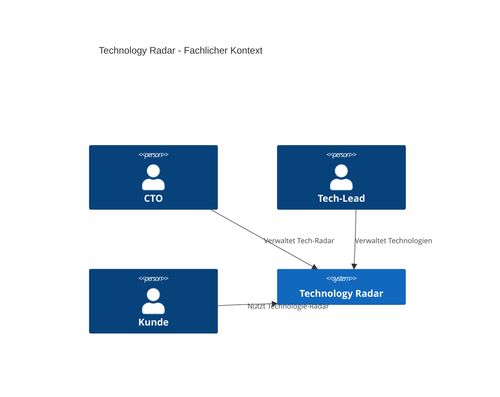
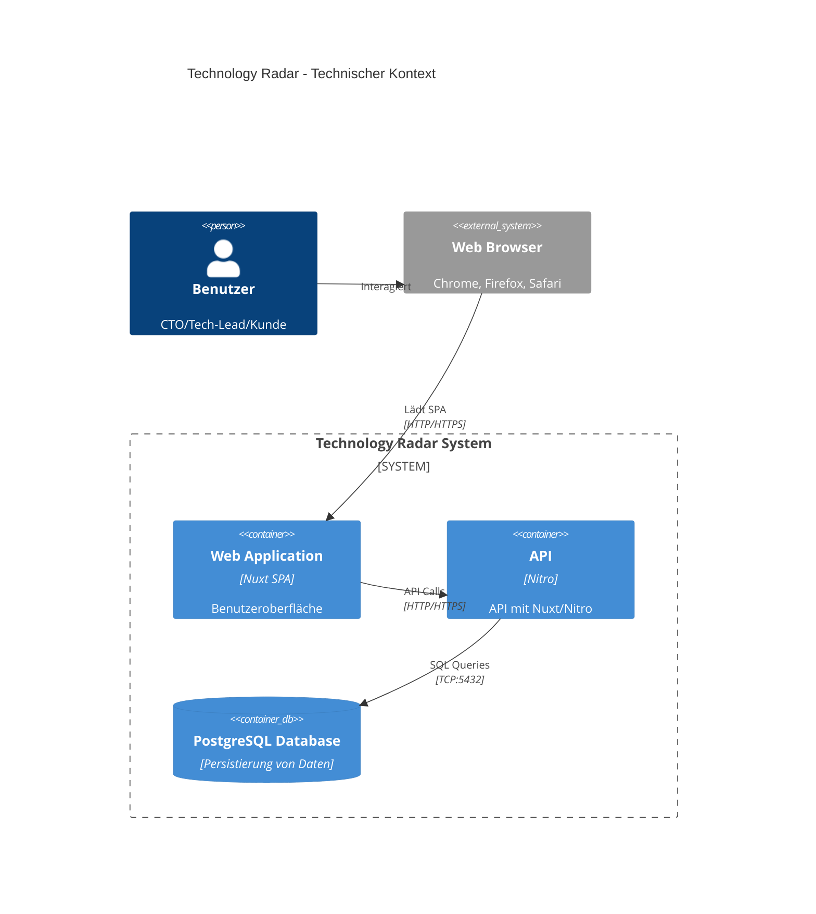
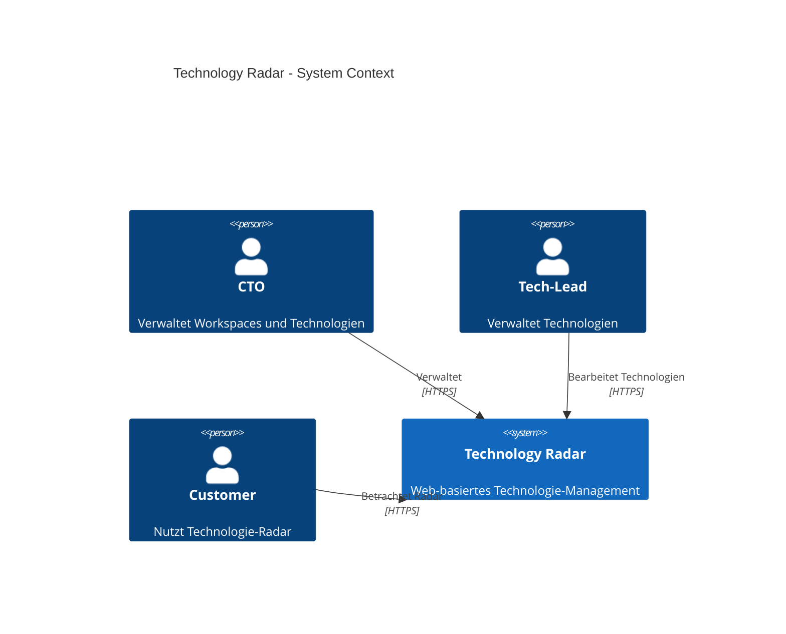
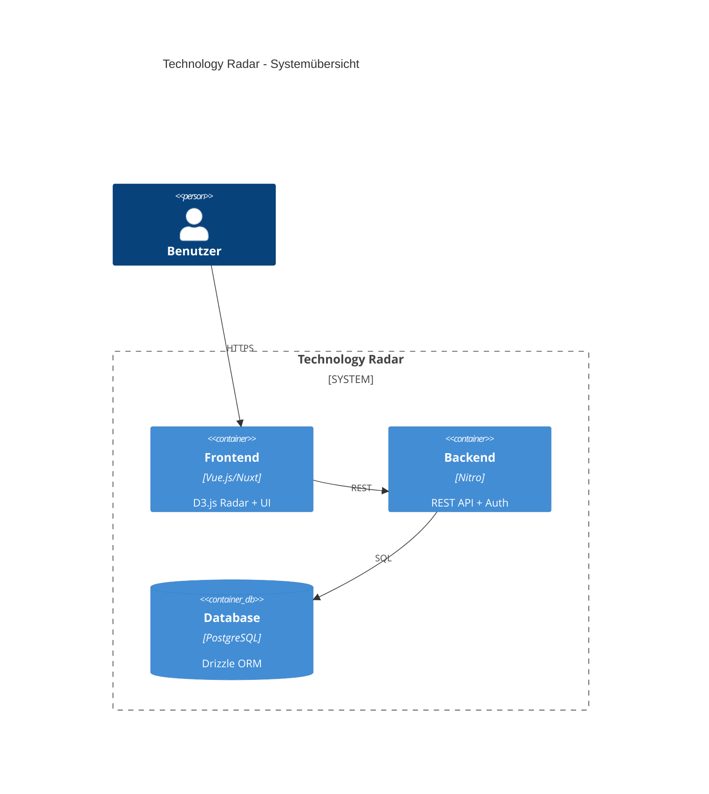
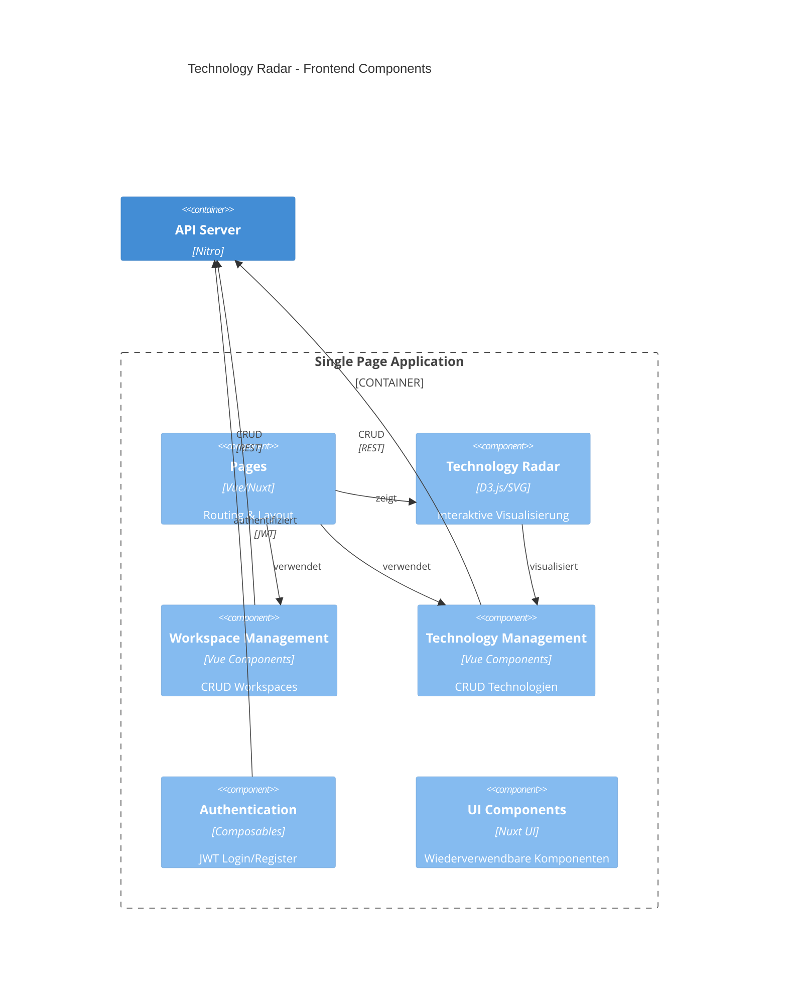
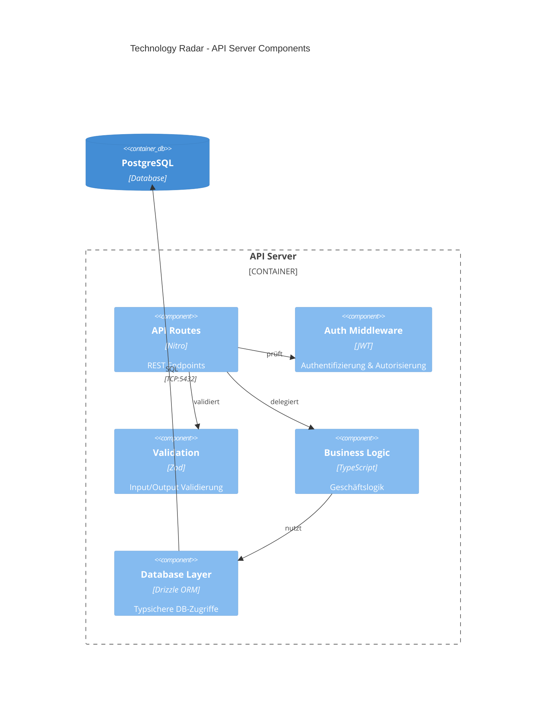
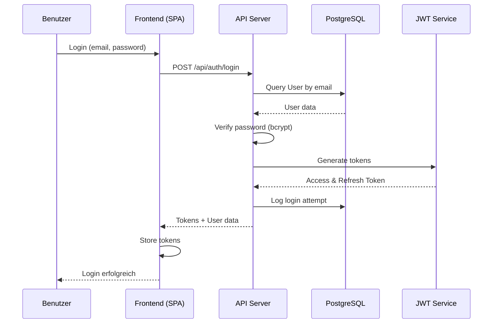
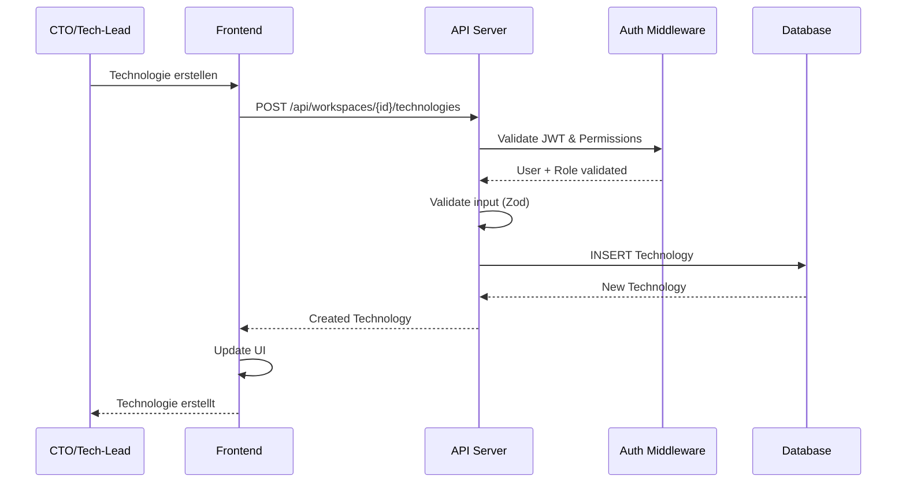
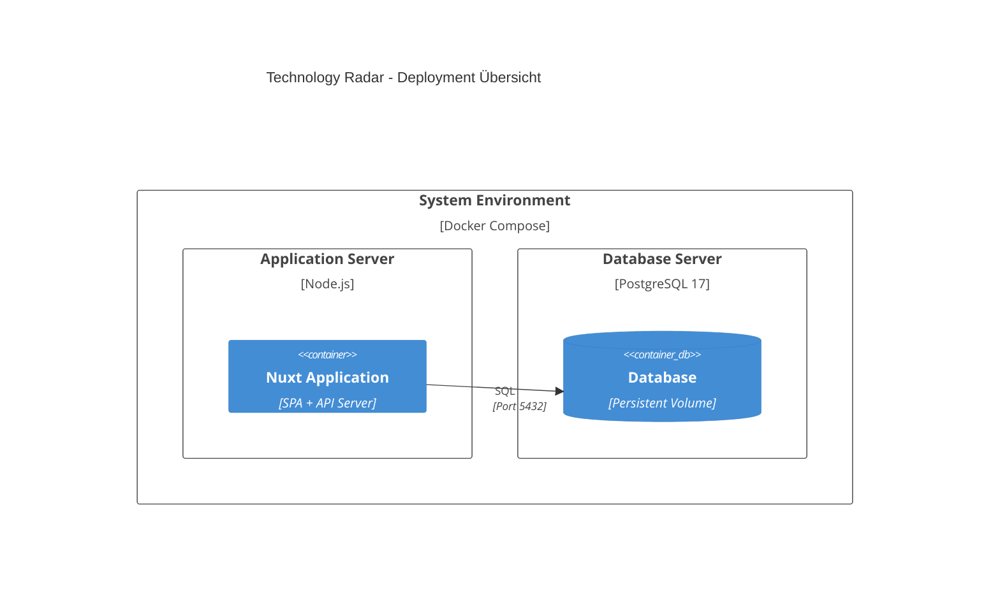

# Dokumentation Technologieradar

## Einführung und Ziele

### Aufgabenstellung

Das **Technology Radar** ist eine Webanwendung, die es Unternehmen und Organisationen ermöglicht, verschiedene Technologien zu kategorisieren, bewerten und deren Entwicklung zu verfolgen. Die Anwendung soll Teams dabei unterstützen, fundierte Entscheidungen über die Adoption neuer Technologien zu treffen.

### Kernfunktionen

- **Technologie-Management**: Kategorisierung in Framework, Tool, Technique, Platform
- **Radar-Visualisierung**: Interaktive D3.js-Darstellung mit vier Bewertungsringen (Adopt, Trial, Assess, Hold)
- **Multi-Workspace**: Organisationseinheiten mit rollenbasierter Zugriffskontrolle
- **Benutzerverwaltung**: JWT-Authentifizierung, CTO/Tech-Lead/Customer-Rollen

### Qualitätsziele

| Priorität | Qualitätsziel | Szenario |
|-----------|---------------|----------|
| 1 | **Benutzerfreundlichkeit** | Intuitive Bedienung der Radar-Visualisierung, einfache Navigation zwischen Workspaces |
| 2 | **Performance** | Schnelle Ladezeiten der Radar-Darstellung auch bei >100 Technologien pro Workspace |
| 3 | **Wartbarkeit** | Saubere Trennung Frontend/Backend, modularer Aufbau, vollständige Typisierung |
| 4 | **Sicherheit** | Sichere Authentifizierung, Autorisierung auf Workspace-Ebene, Input-Validierung |

### Stakeholder

| Rolle | Erwartungshaltung |
|-------|-------------------|
| **CTO** | Administration Workspace und Verwaltung von Technologien und Mitarbeiter |
| **Tech-Lead** | Verwaltung von Technologien in einem Workspace |
| **Mitarbeiter** | Nutzen den Technologie-Radar um Infos bzgl. der eingesetzen Technologien zu erhalten |
| **Software-Entwickler** | Entwickeln und Testen die Applikation |

## Randbedingungen


**Technische Randbedingungen:**
- **Technologien**: Zur Entwicklung des Tech-Radars muss für Frontend und Backend JavaScript bzw. TypeScript verwendet werden.
- **Radar**: Es muss nicht unbedingt ein Radar implementiert werden. Eine Tabelle würde auch reichen.
- **Responsive**: Responsive Design für Desktop und Mobile

**Organisatorische Randbedingungen:**
- **Einzelarbeit**: Das Projekt muss in einzelarbeit erarbeitet werden
- **Entwicklungszeit**: ca. 60 Stunden
- **Dokumentation**: Offen, arc42-Standard empfohlen

## Kontextabgrenzung

### Fachlicher Kontext

Dieses Diagram zeigt die fachlichen Abhängigkeiten im Technologie-Radar auf.



- **CTO**: Verwaltet Workspaces, deren Technologien und Mitglieder
- **Tech-Lead**: Verwaltet Technologien eines Workspaces
- **Kunde**: Nutzt den Technologie-Radar um Infos zu den benutzten Technologien zu erhalten

## Technischer Kontext



Nuxt 4 ist ein Fullstack Framework und erlaubt es somit, Frontend und Backend im gleichen Projekt zu verwalten. Hierbei wird zum einen Vue als Frontend genutzt und mit Nitro kann eine HTTP-API entwickelt werden.

- **Web Application**: Die Webapplikation (SPA), welche vom Browser geladen wird. Diese nutzt Nuxt 4 mit Nuxt UI & TailwindCSS
- **API**: REST-API mit Nuxt 4 / Nitro. Handhabt Business-Logik, Authentifizierung und DB-Zugriff
- **PostgreSQL Database**: Persistierung von Benutzern, Workspaces, Technologien und Login-Logs

# Lösungsstrategie

## Technologie-Entscheidungen

| Bereich | Technologie | Begründung |
|---------|------------|------------|
| **Frontend Framework** | Nuxt.js 4 + Vue.js 3 | Full-Stack-Framework mit SSR/SPA-Flexibilität, ausgereifte TypeScript-Unterstützung, grosses Ecosystem |
| **UI-Framework** | Nuxt UI + Tailwind CSS | Konsistente Design-System-Komponenten, utility-first CSS |
| **Backend** | Nuxt/Nitro Server API | Integrierte Server-API, TypeScript-Sharing zwischen Frontend/Backend, vereinfachtes Deployment |
| **Datenbank** | PostgreSQL | Robuste relationale DB, komplexe Queries, JSON-Support für Flexibilität |
| **ORM** | Drizzle ORM | Type-safe SQL-first ORM, excellente TypeScript-Integration, migrationsfähig |
| **Authentifizierung** | JWT + bcrypt | Stateless Authentication, sichere Password-Hashing |
| **Visualisierung** | D3.js | Mächtige, flexible Datenvisualisierung für interaktive Charts |
| **Testing** | Vitest + Playwright | Moderne, schnelle Test-Runner für Unit- und E2E-Tests |
| **Deployment** | Docker | Einfache Möglichkeit die Applikation zu verbreiten/nutzen |

## Architektur

**3-Schicht-Architektur:**
- **Frontend**: Vue.js/Nuxt SPA mit D3.js-Visualisierung
- **Backend**: Nitro API mit JWT-Auth und Zod-Validierung  
- **Datenbank**: PostgreSQL mit Drizzle ORM

## Bausteinsicht

### Ebene 1 - System Kontext Diagram (C1)



### Ebene 2 - Container Diagram (C2)
https://github.com/moli-03/weblab


### Ebene 3 - Frontend Components (C3)



### Ebene 3 - API Server Components (C3)



## Laufzeitsicht

Ich habe diesen Abschnitt bewusst klein gehalten, da die Dokumentation ansonsten zu gross werden würde. Daher folgen hier als Beispiele der Ablauf von Authentifizierung und Technologieerstellung.

### Benutzer-Authentifizierung



### Technologie erstellen



## Verteilungssicht



**Begründung:**
Die Anwendung ist für lokale Entwicklung mit Docker Compose & den Deploy via Docker Compose konfiguriert. Dies ermöglicht eine konsistente Umgebung mit PostgreSQL-Datenbank.

# Querschnittliche Konzepte

### Sicherheit

**Authentifizierung:**
- JWT-basierte stateless Authentication
- bcrypt für sichere Passwort-Hashing
- Login-Audit-Protokollierung für Sicherheitsmonitoring

**Autorisierung:**
- Role-based Access Control (CTO, Tech-Lead, Customer)
- Workspace-basierte Berechtigung (Owner, Member)
- Resource-level Authorization für API-Endpoints

**Input-Validierung:**
- Zod-Schema-Validierung auf Client und Server
- SQL-Injection-Schutz durch Prepared Statements (Drizzle ORM)
- XSS-Schutz durch automatisches HTML-Escaping (Vue.js)

### Datenvalidierung

**Validierung mittels Zod:**
- Zod ist eine JS-Library für das Validieren von Daten
- Zod wird Client & Server-Seitig zur Datenvalidierung genutzt
- TS-Types können aus Zod-Schemas hergeleitet werden

**Beispiel:**
```typescript
const technologySchema = z.object({
  name: z.string().min(1).max(255),
  category: z.enum(["framework", "tool", "technique", "platform"]),
  ring: z.enum(["adopt", "trial", "assess", "hold"]).optional(),
});
```

### Error Handling

**API Error Handling:**
- Konsistente HTTP-Statuscodes (400, 401, 403, 404, 500)
- Strukturierte Error-Response mit `createError()` (Nitro)
- Error-Logging auf Server-Ebene

**Frontend Error Handling:**
- Try-catch für API-Calls mit `useAsyncData`
- Toast-Notifications für Benutzer-Feedback
- Fallback-UI bei Fehlern

### Logging & Monitoring

**Login-Audit:**
- Persistierung aller Login-Versuche in `login_audit` Tabelle
- IP-Adresse und User-Agent Tracking
- Success/Failure Status mit Failure-Reason

**Entwicklungszeit:**
- Console-Logging für Debugging
- Error-Stack-Traces in Development-Mode

### Datenpersistierung

**Database Design:**
- PostgreSQL
- UUID Primary Keys 
- Foreign Key Constraints für Datenintegrität
- Check Constraints (z.B. published technologies benötigen ring)

**Drizzle ORM:**
- Type-safe SQL queries
- Migration-System für Schema-Änderungen
- Relationship-Definition für komplexe Queries

## Architekturentscheidungen

### Nuxt als Fullstack Framework
Als Framework wurde Nuxt gewählt, da dies eine einheitliche TypeScript-Codebase für Frontend und Backend bereitstellt. Zudem erhält man integrierte API-Routen ohne separaten Server.

### Drizzle ORM
Da ich noch wenig Erfahrung mit JavaScript ORMs hatte, sah Drizzle sehr interessant aus und ich wollte es gerne ausprobieren. Der SQL-first Ansatz und die TypeScript-Integration haben sich im Projektverlauf als sehr wertvoll erwiesen.

### D3.js für Radar-Visualisierung
D3.js bietet eine sehr flexible Möglichkeit, mittels SVGs Diagramme zu zeichnen. Es hat builtin-Funktionalitäten für Interaktionen wie "click" oder "hover" und eine gute Dokumentation.

### Docker für Entwicklung und Deployment
Docker wird sowohl in der Entwicklung als auch für das Deployment eingesetzt und bietet mehrere Vorteile:

**Entwicklungsumgebung:**
- Lokale PostgreSQL-Datenbank via Docker Compose
- Einfaches Setup ohne manuelle Datenbankinstallation

**Deployment:**
- Containerisierung der gesamten Applikation (Frontend + Backend + Datenbank)
- Build-Prozess über Docker für reproduzierbare Deployments
- Plattformunabhängige Bereitstellung der Anwendung

## API-Dokumentation

Die REST-API bietet folgende Endpunkte für die Verwaltung von Authentifizierung, Workspaces, Mitgliedern und Technologien:

### Authentifizierung

| Method | Route | Berechtigung | Beschreibung |
|--------|-------|--------------|---------------|
| POST | `/api/auth/register` | Öffentlich | Benutzerregistrierung mit E-Mail, Passwort und Name |
| POST | `/api/auth/login` | Öffentlich | Benutzeranmeldung, gibt JWT-Tokens zurück |
| POST | `/api/auth/refresh` | Öffentlich | Erneuert Access-Token mit Refresh-Token |
| GET | `/api/auth/me` | Authentifiziert | Gibt aktuelle Benutzerdaten zurück |

### Workspaces

| Method | Route | Berechtigung | Beschreibung |
|--------|-------|--------------|---------------|
| GET | `/api/workspaces` | Authentifiziert | Liste aller verfügbaren Workspaces |
| POST | `/api/workspaces` | Authentifiziert | Erstellt neuen Workspace (Ersteller wird Owner) |
| GET | `/api/workspaces/{id}` | Workspace-Mitglied | Details eines spezifischen Workspaces |
| POST | `/api/workspaces/{id}/join` | Authentifiziert | Beitritt zu öffentlichem Workspace |
| POST | `/api/workspaces/{id}/leave` | Workspace-Mitglied | Verlassen eines Workspaces (nicht für Owner) |
| POST | `/api/workspaces/{id}/invite` | CTO | Erstellt Einladungstoken für Workspace |

### Workspace-Mitglieder

| Method | Route | Berechtigung | Beschreibung |
|--------|-------|--------------|---------------|
| GET | `/api/workspaces/{id}/members` | Workspace-Mitglied | Liste aller Mitglieder eines Workspaces |
| PATCH | `/api/workspaces/{id}/members/{userId}` | CTO | Ändert Rolle eines Mitglieds (cto, tech-lead, customer) |
| DELETE | `/api/workspaces/{id}/members/{userId}` | CTO | Entfernt Mitglied aus Workspace (nicht Owner oder sich selbst) |

### Technologien

| Method | Route | Berechtigung | Beschreibung |
|--------|-------|--------------|---------------|
| GET | `/api/workspaces/{id}/technologies` | Workspace-Mitglied | Liste aller Technologien eines Workspaces |
| POST | `/api/workspaces/{id}/technologies` | CTO/Tech-Lead | Erstellt neue Technologie im Workspace |
| PUT | `/api/workspaces/{id}/technologies/{technologyId}` | CTO/Tech-Lead | Aktualisiert bestehende Technologie |
| DELETE | `/api/workspaces/{id}/technologies/{technologyId}` | CTO/Tech-Lead | Löscht Technologie aus Workspace |

### Einladungen

| Method | Route | Berechtigung | Beschreibung |
|--------|-------|--------------|---------------|
| GET | `/api/invite/{token}` | Öffentlich | Validiert Einladungstoken und gibt Workspace-Infos zurück |
| POST | `/api/invite/{token}` | Authentifiziert | Nimmt Einladung an und fügt Benutzer zum Workspace hinzu |

### Berechtigungsrollen

| Rolle | Berechtigungen |
|-------|----------------|
| **CTO** | Vollzugriff auf Workspace: Mitglieder verwalten, Rollen ändern, Technologien verwalten, Einladungen erstellen |
| **Tech-Lead** | Technologien erstellen, bearbeiten und löschen |
| **Customer** | Nur lesender Zugriff auf Technologie-Radar |
| **Owner** | Wie CTO, kann aber nicht aus eigenem Workspace entfernt werden |

**Authentifizierung:**
- JWT-basierte Authentifizierung über Authorization Header: `Bearer <token>`
- Access-Token: 15 Minuten Gültigkeit
- Refresh-Token: 7 Tage Gültigkeit
- Automatische Token-Erneuerung im Frontend

## Qualitätsanforderungen

Die Applikation sollte folgende Qualitätsanforderungen erreichen:
- **Testing**: Die Funktionalitäten sollen mittels sinnvollen Unit/Integrations-Tests überprüft werden.
- **Geschwindigkeit**: Der Technologie-Radar soll bei einer 4G-Verbindung innerhalb 2s geladen werden.
- **Responsive**: Der Technologie-Radar soll, neben der Desktop-Ansicht, auch für Mobile/Tablet-Ansichten optimiert sein.

## Risiken und technische Schulden

### Identifizierte Risiken

| Risiko | Wahrscheinlichkeit | Impact | Mitigation |
|--------|-------------------|---------|------------|
| **D3.js Complexity** | Mittel | Hoch | Schrittweise Implementierung, umfangreiche Dokumentation |
| **Performance bei vielen Technologien** | Mittel | Mittel | Paginierung, Caching |
| **Browser Compatibility** | Niedrig | Mittel | Adaptierung von Features in Browsern prüfen, Polyfills bei Bedarf |

### Technische Schulden

- **Testing**: Einführung zusätzlicher Tests. Vor allem API und Frontend-Tests.
- **Internationalisierung**: Support für mehrere Sprachen anbieten.
- **Performance**: Verbesserung der Performance mittels caching.

## Reflektion
Da ich bereits aus dem Web-Development-Bereich komme, konnte ich viele meiner bisherigen Erfahrungen in das Projekt einbringen. Nuxt war mir zuvor schon begegnet, allerdings hatte ich es bisher noch nie praktisch eingesetzt. Im Verlauf des Projekts konnte ich mich intensiv mit Nuxt 4 beschäftigen und habe ein besseres Verständnis dafür gewonnen, wie flexibel es als Fullstack-Framework einsetzbar ist.

Eine der grössten Herausforderungen für mich war das UI-Design, da ich in diesem Bereich bisher nur wenig Erfahrung gesammelt habe. Anfangs fiel es mir schwer, ein konsistentes und ansprechendes Interface zu gestalten. Durch die Arbeit mit Nuxt UI Components in Kombination mit TailwindCSS kam dann schlussendlich doch ein brauchbares UI zustande.

Besonders interessiert hat mich der Einsatz von Drizzle ORM. Mein Ziel war es, Drizzle besser kennenzulernen und zu prüfen, ob ich es auch für zukünftige Projekte verwenden könnte. Dabei hat mir die starke TypeScript-Integration und die Klarheit des SQL-first-Ansatzes sehr gefallen.

Insgesamt konnte ich durch das Projekt meine Kenntnisse in Nuxt, Nitro, UI-Design und Drizzle erweitern und wertvolle Erfahrungen sammeln, die mir bei zukünftigen Projekten zugutekommen werden.

## Fazit
Das Projekt hat mir sehr viel Spass gemacht. Ich konnte intensiv mit Nuxt 4 arbeiten und dabei viel über die Entwicklung einer Fullstack-Anwendung lernen. Besonders spannend war für mich der Einsatz von Drizzle ORM, PostgreSQL und Zod, wodurch ich meine Kenntnisse in typsicheren Datenbankzugriffen und Datenvalidierung erweitern konnte. Auch der Einsatz von Vitest für Tests hat mir gezeigt, wie wichtig automatisiertes Testing für sauberen und wartbaren Code ist. Insgesamt konnte ich in diesem Projekt viele neue Technologien praktisch anwenden und wertvolle Erfahrungen für zukünftige Web-Development-Projekte sammeln.

